[中文说明](README.zh.md)
# **_plugin_patch_**

If you have any features you want to add or bugs, please join the QQ group: 945280107 for feedback.

#### Command Line Version Introduction

A script that integrates various software installations on Steam Deck. It is simple and convenient to use, without a graphical interface.

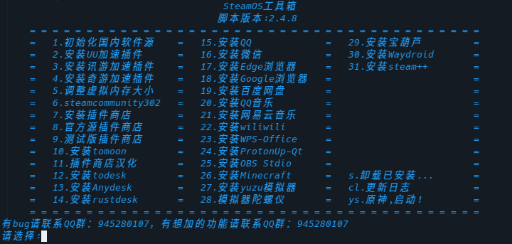

#### ~~Usage Tutorial~~No need to trouble yourself, the following command will solve it.

```
curl -s -L https://vip.123pan.cn/1824872873/releases/plugin_patch_zenity.sh | sudo sh -
```

#### Usage Tutorial

1. Download the script to deck

```bash
cd /home/deck/Downloads
```
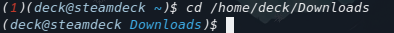

```bash
curl -O https://vip.123pan.cn/1824872873/releases/plugin_patch.sh
```


2. Grant execution permission to the script

```bash
chmod +x plugin_patch.sh
```
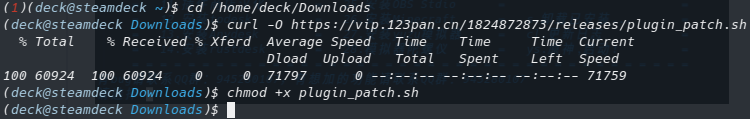

3. Switch to the administrator user (enter password)

```bash
sudo su
```
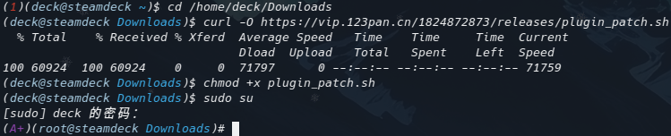

4. Run the script

```bash
sh plugin_patch.sh
```
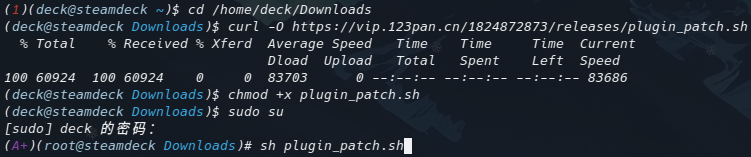

# **_plugin_patch_zenity_**

#### Graphical Version Introduction

A script that integrates various software installations on Steam Deck. It is simple and convenient to use, with a graphical interface.
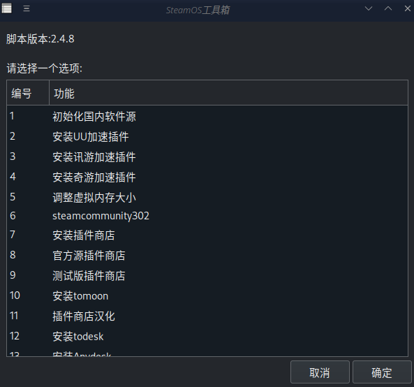

#### Usage Tutorial

1. Download the script to deck

```bash
cd /home/deck/Downloads
```
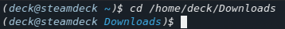

```bash
curl -O https://vip.123pan.cn/1824872873/releases/plugin_patch_zenity.sh
```
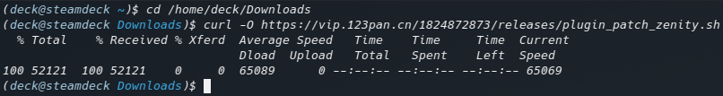

2. Grant execution permission to the script

```bash
chmod +x plugin_patch_zenity.sh
```
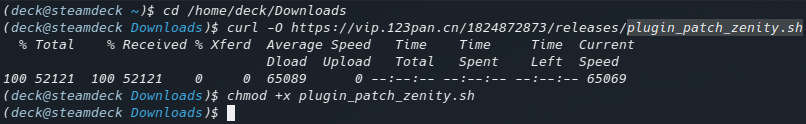

3. Switch to the administrator user (enter password)

```bash
sudo su
```
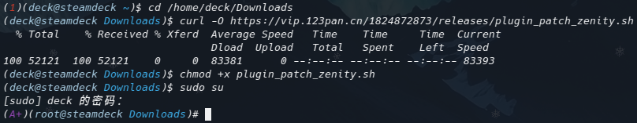

4. Run the script

```bash
sh plugin_patch_zenity.sh
```
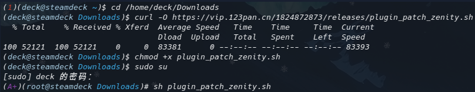

# **_Function Introduction_**

1. Initialize domestic software sources and update the system
   This option must be selected when opening the script; otherwise, most functions will be unavailable.
   The process takes about 5 minutes.
   It is strongly recommended to restart the system immediately after execution.

2. Install UU Accelerator Plugin
   Accelerates Steam store for free; other games require a fee.
   **_Only accelerates Steam, not other software installations_**
   **_Only accelerates Steam, not other software installations_**
   **_Only accelerates Steam, not other software installations_**

3. Install Xunyou Accelerator Plugin
   Same as above.

4. Install Qiyou Accelerator Plugin
   Same as above.

5. Adjust virtual memory size
   Improves stuttering issues for some games and solves crash problems. Recommended size is 30, do not exceed 50.

6. Steamcommunity302
   Software to accelerate Steam. Once installed, it starts automatically on boot, no need to open it manually.

7. Install Plugin Store
   Domestic source plugin store. Installation may fail due to network issues (not your network issue, try again in a few days).
   **_Enable developer mode and CEF remote debugging in game mode before installation_**
   **_Install the stable store for the stable system, and the beta store for the beta system_**
   Wondering how to check if you're on the stable or beta version? In desktop mode, check in Steam settings -> Interface. In game mode, check in Settings -> System.

8. Official Source Plugin Store
   Stable plugin store from official sources, located abroad. Requires a VPN; UU, Xunyou, Qiyou, and Steamcommunity302 are ineffective.

9. Beta Plugin Store
   For beta systems only (Steam Family Group Beta, Beta version), located abroad. Requires a VPN; UU, Xunyou, Qiyou, and Steamcommunity302 are ineffective.

10. Install Tomoon
    **_Install the plugin store before installing Tomoon, do not install Tomoon directly_**
    Installation may fail due to network issues (not your network issue, try again in a few days).

11. Plugin Store Localization
    **_Install the plugin store and Tomoon before localizing, do not localize directly_**
    Localization for 8 commonly used plugins.
    Provided by the expert Steam Deck Superman.

12. Install ToDesk
    Remote software. This is a modified version, pay attention to prompts during installation. If you have the official version, uninstall it according to the prompts.

13. Install AnyDesk
    Remote software. Must execute the initialization of domestic software sources first.

14. Install RustDesk
    Remote software, an alternative to ToDesk.

15. Install QQ
    Native Linux version. Must execute the initialization of domestic software sources first.

16. Install WeChat
    Native Linux version. Must execute the initialization of domestic software sources first.

17. Install Edge Browser
    Native Linux version. Must execute the initialization of domestic software sources first.

18. Install Google Chrome
    Native Linux version. Must execute the initialization of domestic software sources first.

19. Install Baidu Netdisk
    Native Linux version. Must execute the initialization of domestic software sources first.

20. Install QQ Music
    Native Linux version. Must execute the initialization of domestic software sources first.

21. Install NetEase Cloud Music
    Native Linux version. Must execute the initialization of domestic software sources first.
    Currently has some issues and may not work.

22. Install Wiliwili
    Native Linux version. Must execute the initialization of domestic software sources first.
    Bilibili client.

23. Install WPS-Office
    Native Linux version. Must execute the initialization of domestic software sources first.

24. Install ProtonUp-Qt
    Compatibility layer installation software. Must execute the initialization of domestic software sources first.

25. Install OBS Studio
    Live streaming and recording software. Must execute the initialization of domestic software sources first.

26. Install Minecraft
    HMCL launcher. Must execute the initialization of domestic software sources first.
    After entering, you need to manually switch to Chinese.

27. Install Yuzu Emulator
    Latest release version.

28. Emulator Gyroscope
    Suitable for Yuzu and Cemu emulators, for example, you can use the built-in gyroscope of the deck to solve Zelda temples.
    After installation, you need to run `systemctl --user -q enable --now sdgyrodsu.service` in a new terminal to start the service.

29. Install Baohulu
    A multifunctional tool with features like Steam acceleration, shader cache cleaning, store source switching, community compatibility layer download, file transfer within the same LAN, memory performance optimization, various problem-solving tutorials, and more. It is a very powerful tool.

30. Install Waydroid Android Emulator
    Allows downloading mobile applications on the deck.
    **_Requires a VPN_**

31. Install Steam++
    A bit difficult to use, not recommended. Steamcommunity302 is better (not really).

32. Uninstall Installed Software
    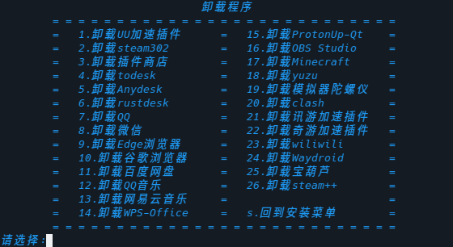
