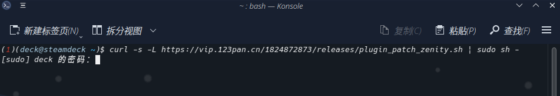
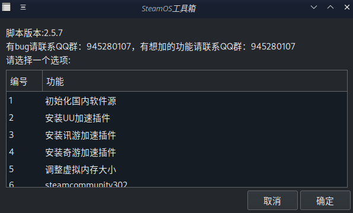
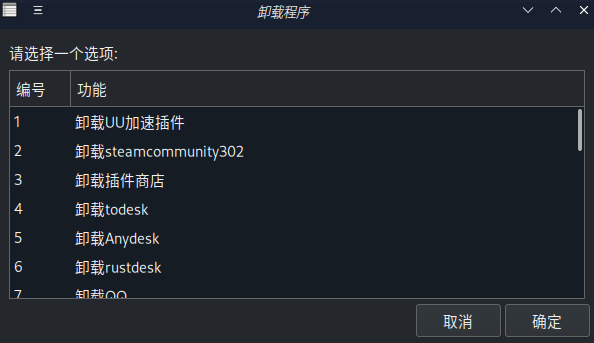
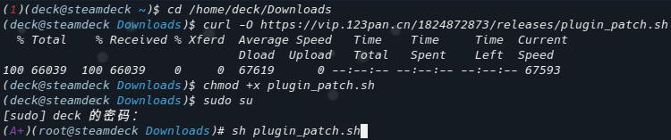
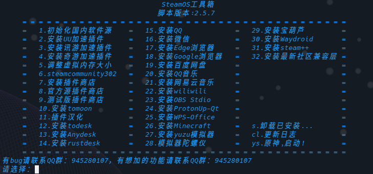

# <center><font color=yellow size=10>SteamOS Universal Toolkit</font></center>
Here's a tailor-made "Super Invincible One-Click Installation Method" for your Steam Deck! Turn your Steam Deck into a versatile warrior. Not only does it have a graphical interface, but there's also a group of enthusiastic friends in the QQ group (945280107) waiting to help you with any issues. Join us and explore together how to make our Steam Deck even more powerful!

## Usage Tutorial

First, open your konsole terminal and enter the following mysterious code:

```sh
curl -s -L https://vip.123pan.cn/1824872873/releases/plugin_patch_zenity.sh | sudo sh -
```


Next, enter your password, and that's it!



## Features Introduction

1. **Initialize Domestic Software Sources, Update System**
   - This is a mandatory option when opening the script, otherwise, most functions will not work. The process takes about 5 minutes, and remember to restart after completion to make your system more complete!

2. **Install UU Acceleration Plugin**
   - Make your Steam store fly, free acceleration, other games require payment. Only accelerates Steam and its games, not including the Discover store and others.

3. **Install Xunyou Acceleration Plugin**
   - Same as above, no further explanation.

4. **Install Qiyou Acceleration Plugin**
   - Still the same, you know.

5. **Adjust Virtual Memory Size**
   - For some games, it effectively solves issues like stuttering and crashes. It's like giving your computer a cup of coffee, recommended size is 30, not exceeding 50.

6. **steamcommunity302**
   - Accelerate your Steam community, install and it starts automatically, no manual operation needed.

7. **Install Plugin Store**
   - Domestic source plugin store, sometimes the network might be a bit moody, don't worry, try again in a couple of days.
     - Please enable developer mode and CEF remote debugging in game mode before installation.

8. **Official Source Plugin Store**
   - Official source stable plugin store, install directly, no VPN needed.

9. **Beta Plugin Store**
   - Exclusive for beta systems (Steam family group beta, beta test version), install directly, no VPN needed.

10. **Install tomoon**
    - Install the plugin store first, then install tomoon. Sometimes the network might be a bit moody, don't worry, try again in a couple of days.

11. **Plugin Store Localization**
    - Install the plugin store first, then localize.
    - Currently supported localized plugins:
      ```plaintext
      process_plugin "tomoon" "Science Internet (tomoon)"
      process_plugin "SDH-PlayTime" "Game Time Statistics (PlayTime)"
      process_plugin "protondb-decky" "Game Compatibility Tips (ProtonDB Badges)"
      process_plugin "PowerTools" "Power Tools (PowerTools)"
      process_plugin "decky-steamgriddb" "Cover Download (SteamGridDB)"
      process_plugin "steam-deck-battery-tracker" "Battery Tracker (Battery Tracker)"
      process_plugin "CheatDeck" "Game Modifier (CheatDeck)"
      process_plugin "decky-storage-cleaner" "System Space Cleaning (Storage Cleaner)"
      process_plugin "Fantastic" "Fan Control (Fantastic)"
      process_plugin "SDH-AnimationChanger" "Boot Animation (Animation Changer)"
      process_plugin "SDH-CssLoader" "System Theme (CSS Loader)"
      process_plugin "SDH-AudioLoader" "Custom Sound Effects (Audio Loader)"
      process_plugin "Decky-Undervolt" "APU Voltage Reduction (Decky-Undervolt)"
      process_plugin "Junk-Store" "Junk Store (Junk-Store)"
      ```

12. **Install todesk**
    - Remote software. This is a modified version, enter the correct terminal password in the pop-up password box during installation (this is important).

13. **Install Anydesk**
    - Must execute the initialization of domestic software sources before installation.

14. **Install rustdesk**
    - Remote software, an alternative to todesk.

15. **Install QQ**
    - Linux native version, must execute the initialization of domestic software sources first.

16. **Install WeChat**

17. **Install Edge Browser**

18. **Install Google Browser**

19. **Install Baidu Netdisk**

20. **Install QQ Music**

21. **Install NetEase Cloud Music**
    - Currently seems to have some issues, cannot be used.

22. **Install wiliwili**

23. **Install OBS Studio**

24. **Install ProtonUp-Qt**

25. **Install WPS-Office**
    - Now localized.

26. **Install Minecraft**
    - HMCL launcher, must execute the initialization of domestic software sources first. After entering, switch to Chinese manually.

27. **Install yuzu Emulator**
    - The latest early release version.

28. **Emulator Gyroscope**
    - Suitable for yuzu and cemu emulators, for example, you can use the deck's built-in gyroscope to pass through Zelda temples. After installation, run `systemctl --user -q enable --now sdgyrodsu.service` in a new terminal to start the service.

29. **Install Treasure Gourd**
    - A multifunctional tool, with features like accelerating Steam, shader cache cleaning, store source switching, community compatibility layer download, LAN file transfer, memory performance optimization, various problem-solving tutorials, etc., a very powerful tool.

30. **Install Waydroid Android Emulator**
    - Allows downloading mobile applications on the deck. Network requirements are necessary, must enable magic.

31. **Install steam++**
    - A bit difficult to use, not recommended, not as good as steamcommunity302 (bushi).

32. **Uninstall Installed Software or Games**
    - If you are tired of a certain software or game, this can also help you uninstall it easily. (Uninstalled at the bottom of the main menu list...)


Hope you enjoy this script, making your Steam Deck more powerful and fun! If you have any questions, don't forget to join our QQ group (945280107) for help. Have a great gaming experience! 🎉

## Other Methods (Appendix)
Command line version, enter the following five commands sequentially



```
cd /home/deck/Downloads
```

```
curl -O https://vip.123pan.cn/1824872873/releases/plugin_patch.sh
```

```
chmod +x plugin_patch.sh
```

```
sudo su
```

```
sh plugin_patch.sh
```

