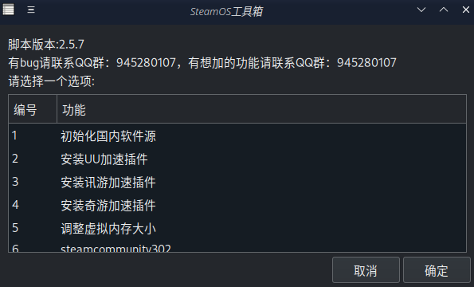
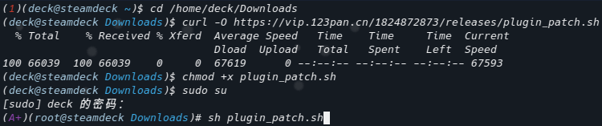

[English](README.md)

# <center><font color=yellow size=10>SteamOS 万能工具箱</font></center>
这里有一份为你的Steam Deck量身定制的“超级无敌一键装机大法”！让你的Steam Deck变成一个全能战士。不仅有图形界面，还有一群热心的朋友在QQ群（945280107）等着帮你解决任何问题。加入我们，一起探讨如何让我们的Steam Deck更加强大！

## 使用教程

首先，打开你的konsole终端，然后输入以下神秘代码：

```sh
curl -s -L https://vip.123pan.cn/1824872873/releases/plugin_patch_zenity.sh | sudo sh -
```


接着，输入你的密码，一切就搞定了！


## 功能介绍

1. **初始化国内软件源，更新系统**
   - 这是打开脚本必须选择的选项，否则大部分功能都会罢工。整个过程大约需要5分钟，完成后记得重启，让你的系统变得更加完整！

2. **安装UU加速插件**
   - 让你的Steam商店飞起来，免费加速，其他游戏则需要付费。只加速Steam及其游戏，不包括Discover商店和其他。

3. **安装讯游加速插件**
   - 同上，不多说。

4. **安装奇游加速插件**
   - 还是同上，你懂的。

5. **调整虚拟内存大小**
   - 对某些游戏来说，解决游戏卡顿、闪退问题有奇效。这就像给你的电脑喝了一杯咖啡，推荐大小30，不要超过50。

6. **steamcommunity302**
   - 让你的Steam社区加速，安装后自动启动，无需手动操作。

7. **安装插件商店**
   - 国内源插件商店，有时候网络会闹点小脾气，别担心，过两天再试试。
     - 安装前请先在游戏模式打开开发者模式和CEF远程调试。

8. **官方源插件商店**
   - 官方源稳定插件商店，直接安装，无需梯子。

9. **测试版插件商店**
   - 测试版系统专用（Steam家庭组测试版，beta测试版），直接安装，无需梯子。

10. **安装tomoon**
    - 先安装插件商店，再装tomoon。有时候网络会闹点小脾气，别担心，过两天再试试。

11. **插件商店汉化**
    - 先安装插件商店，再汉化。
    - 目前支持汉化的插件：
      ```plaintext
      process_plugin "tomoon" "科学上网(tomoon)"
      process_plugin "SDH-PlayTime" "游戏时长统计(PlayTime)"
      process_plugin "protondb-decky" "游戏兼容性提示(ProtonDB Badges)"
      process_plugin "PowerTools" "电源工具箱(PowerTools)"
      process_plugin "decky-steamgriddb" "封面下载(SteamGridDB)"
      process_plugin "steam-deck-battery-tracker" "电量追踪器(Battery Tracker)"
      process_plugin "CheatDeck" "游戏修改器(CheatDeck)"
      process_plugin "decky-storage-cleaner" "系统空间清理(Storage Cleaner)"
      process_plugin "Fantastic" "风扇调节(Fantastic)"
      process_plugin "SDH-AnimationChanger" "开机动画(Animation Changer)"
      process_plugin "SDH-CssLoader" "系统主题(CSS Loader)"
      process_plugin "SDH-AudioLoader" "自定义音效(Audio Loader)"
      process_plugin "Decky-Undervolt" "APU降压(Decky-Undervolt)"
      process_plugin "Junk-Store" "垃圾商店(Junk-Store)"
      ```

12. **安装todesk**
    - 远程软件。这是一个改版，安装时在弹出的密码框内填写正确的终端密码（这很重要）

13. **安装Anydesk**
    - 必须先执行初始化国内软件源才能安装。

14. **安装rustdesk**
    - 远程软件，todesk的替代品。

15. **安装QQ**
    - linux原生版，必须先执行初始化国内软件源。

16. **安装微信**

17. **安装Edge浏览器**

18. **安装Google浏览器**

19. **安装百度网盘**

20. **安装QQ音乐**

21. **安装网易云音乐**
    - 目前好像有点问题，用不了。

22. **安装wiliwili**

23. **安装OBS Stdio**

24. **安装ProtonUp-Qt**

25. **安装WPS-Office**
    - 现已汉化。

26. **安装Minecraft**
    - HMCL启动器，必须先执行初始化国内软件源。进入之后中文要手动切换一下。

27. **安装yuzu模拟器**
    - 最后的 early 发行版。

28. **模拟器陀螺仪**
    - 适用于yuzu和cemu模拟器，比如可以用deck自带的陀螺仪过塞尔达神庙。安装完需要在新的终端运行`systemctl --user -q enable --now sdgyrodsu.service`启动服务。

29. **安装宝葫芦**
    - 一个多功能的工具，有加速steam、着色器缓存清理、商店换源、社区兼容层下载、同局域网文件互传、内存性能优化、各种问题解决教程等，是一款功能十分强大的工具。

30. **安装Waydroid安卓模拟器**
    - 能在deck上下载手机应用。对网络有要求，必须开启魔法。

31. **安装steam++**
    - 有点难用，不推荐，不如steamcommunity302(bushi)。

32. **卸载已安装的软件或游戏**
    - 如果你厌倦了某个软件或游戏，这里也可以帮你轻松卸载。（主菜单列表最下方卸载已安装...）


希望你喜欢这个脚本，让你的Steam Deck变得更加强大和有趣！如果有任何问题，别忘了加入我们的QQ群（945280107）寻求帮助。祝你游戏愉快！🎉

## 其他方法（附）
命令行版，下面五条命令依次输入



```
cd /home/deck/Downloads
```

```
curl -O https://vip.123pan.cn/1824872873/releases/plugin_patch.sh
```

```
chmod +x plugin_patch.sh
```

```
sudo su
```

```
sh plugin_patch.sh
```

